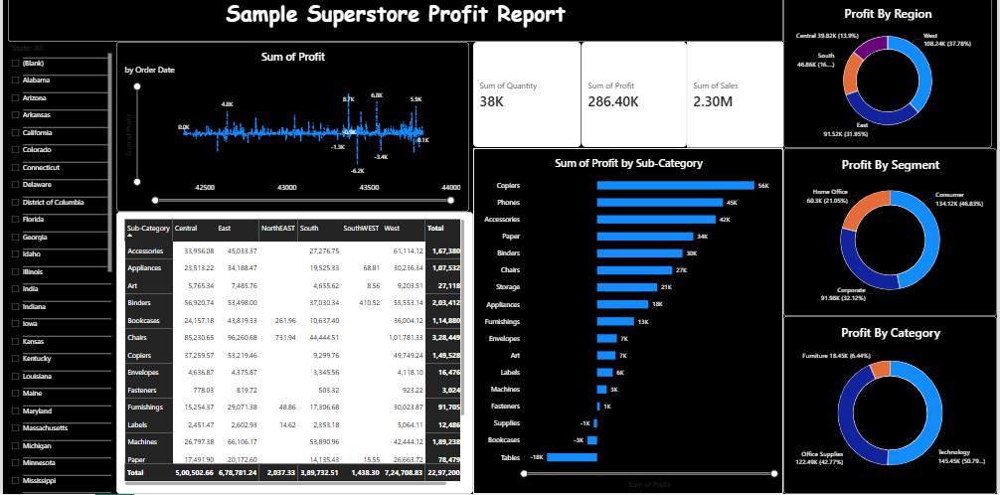

# Superstore Profit Dashboard (Power BI)

# Overview
This project is a Power BI dashboard analyzing sales, profit, and quantity across regions, categories, and segments.

# Features
- Profit trend over time  
- Region & segment analysis  
- Category and sub-category insights  
- KPI cards (Sales, Profit, Quantity)  
- Interactive filters  

# Key Insights
- West region has highest profit  
- Technology category leads revenue  
- Tables show negative profit  
- Consumer segment dominates sales  

# Tools Used
- Power BI  
- DAX  
- Data Cleaning  

# Dataset
Sample Superstore dataset (sales, profit, region, category, segment)

# Preview

# How to Use
Download the `.pbix` file and open in Power BI Desktop.
